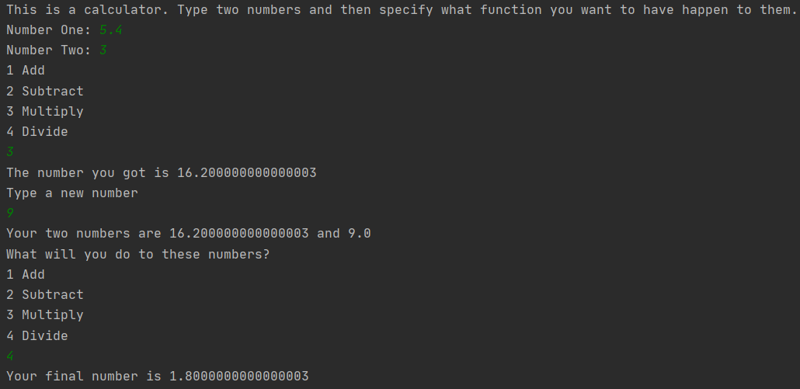

# Overview
A simple calculator made in Kotlin that will compute a few numbers that the user gives it

# Developement Enviroment

* Intellij
* Kotlin

# Execution

To run the program, open it in Intellij and click the "Run" button. You can also right click the program in its development area and run it from there.

# Useful Information

[Kotlin Reference and tutorial site](https://kotlinlang.org/docs/reference/)